## Hướng dẫn cài đặt Ubuntu Server trên VMware 
### Chuẩn bị:
 Phần mềm Vmware, file iso phiên bản Ubuntu server muốn cài đặt.
### Các bước thực hiện
- Mở Vmware chọn Create a New Virtual Machine để tạo 1 máy ảo mới

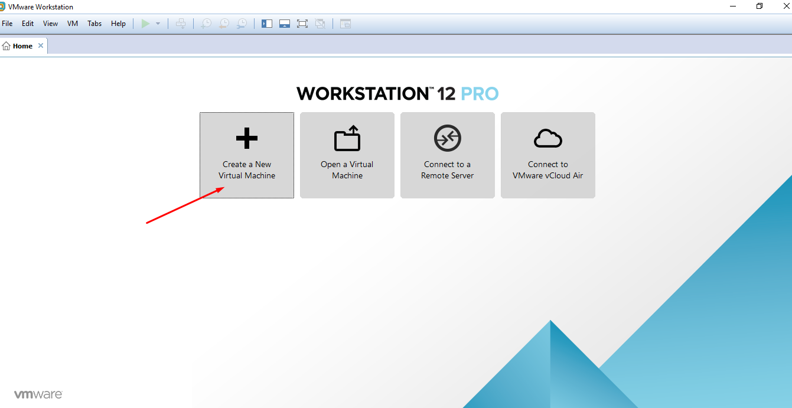

- Lựa chọn loại cấu hình

	- Option **Typical(recommendede)**: Tạo theo định dạng măc định của máy
	- Option **Custom(advanced)**: Các tùy chọn do người dùng cài đặt
	- Máy ảo được cài đặt với một số tùy chọn mở rộng khác

Ở đây mình chọn **Custom**. Nhấn **Next** để tiếp tục.

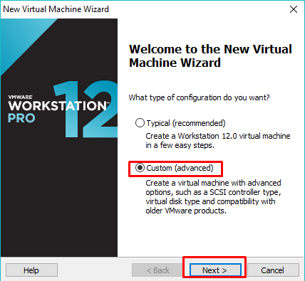

- Tương thích phần cứng: Ở đây phiên bản Umware mình cài là 12.0. Nhấn **Next**

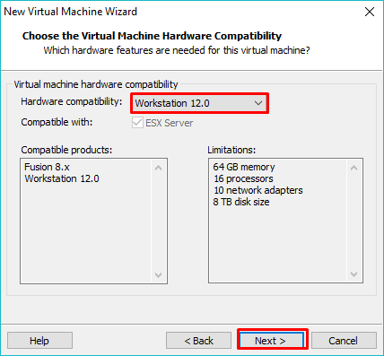

- Cài đặt Hệ điều hành

	- Installer disc: Sử dụng ổ đĩa để cài đặt
	- Installer disc image file(isso): cài băng file iso
	- I will     Cài đặt hệ điều hành sau. Máy ảo sẽ được tạo với đĩa cứng trống

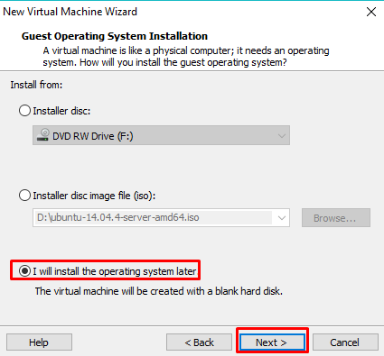
	

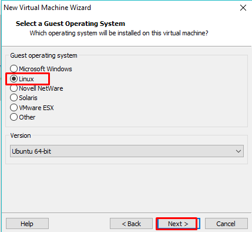

- Đặt tên máy ảo và vị trí lưu trữ máy ảo. Muốn thay đổi vị trí nhấn **Browse** chọn vị trí muốn lưu.

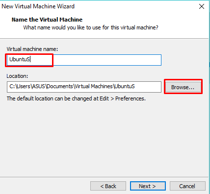

- Cấu hình bộ vi xử lý (CPU)
	- Số bộ vi xử lý
	- Số lõi trên từng bộ vi xử lý

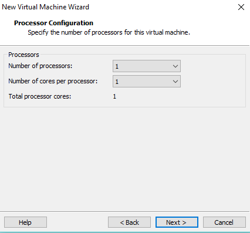

- Thiết lập kích thước bộ (RAM)

	- Kích thước tối đa cho phép là 6320MB. 
	- Kích thước khuyến nghị là 1024MB. 
	- Kích thước tối thiểu là 512MB.

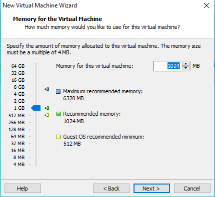

- Kiểu kết nối mạng

	- Kiểu Bridge: Máy ảo sử dụng chung card vật ký với máy thật. Chung dải mạng với máy thậy và có thể ra ngoại internet
	- Nat: Máy ảo tạo 1 card mạng ra ngoài máy thật. Có teher ra ngoài internet
	- Hostonly:  Máy ảo tạo 1 card mạng ngoài máy thật và không thể ra ngoài internet 
	- Không sử dụng để kết nối mạng

Kiểu kết nối này có thể thay đổi được sau.

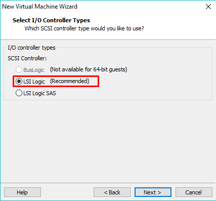

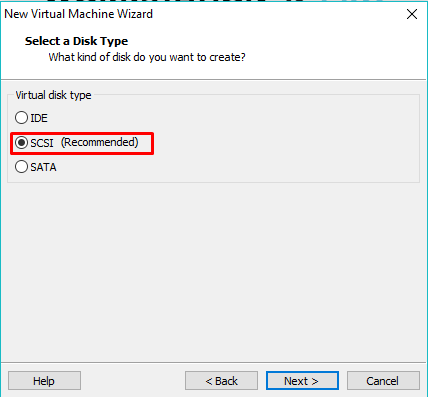

- Lựa chọn ổ đĩa
	- Create a new vitual disk: Tạp 1 đĩa ảo mới
	- Use an existing virtual disk : Sử dụng 1 ổ đĩa hiện có. Chọn tùy chọn này để sử dụng lại đĩa được cấu hình trước đó
	- Use a physical disk ( for advanced users) Sử dụng ổ đĩa vật lý.

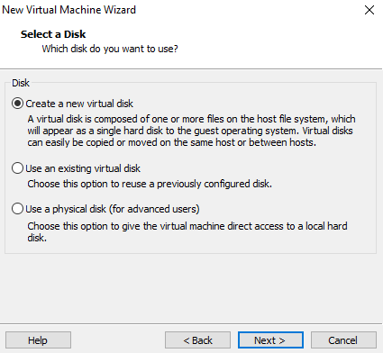

- Thiết lập kích thước ổ đĩa
	- Kích thước khuyến nghị là 20GB
	- Allocate all disk space now: Phân bổ tất cả dung lượng đĩa ngay bây giờ
	- Store vitual disk as a single file: Lưu ổ đĩa cứng vào 1 file đơn
	- Split virtual disk into mutiple files: Chia ổ cứng thành nhiều file

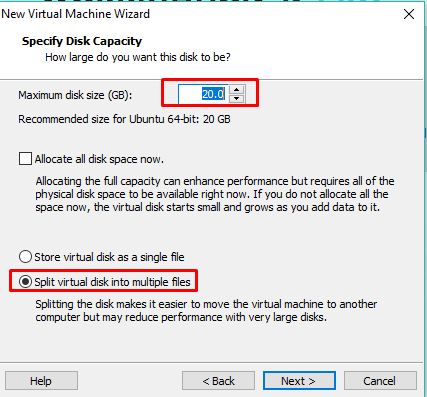

- Lưu file .vmdk (file đĩa ảo) Vào cùng thư mục máy ảo đã tạo ở bước trên 

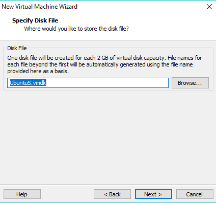

- Xem lại tất cả các cấu hình, thiết lập máy ảo rồi nhấn **Finish** để tiến hành cài đặt

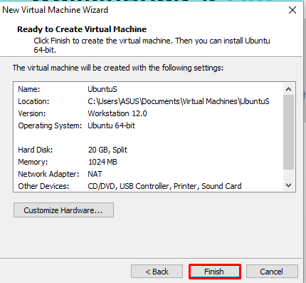

- Chọn Settings

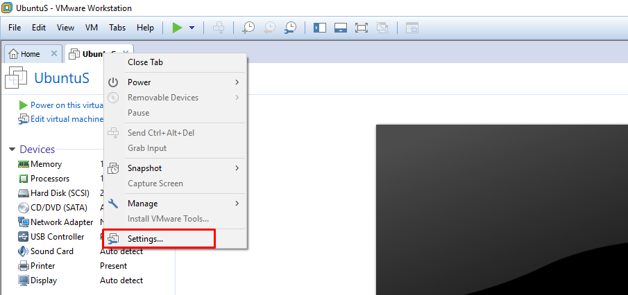

- Chọn file iso để cài đặt 

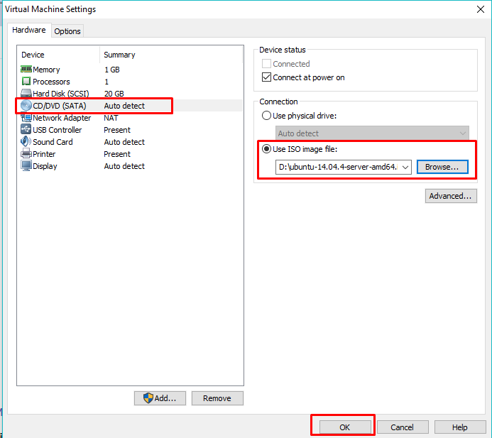

- Lựa chọn ngôn ngữ trong quá trình cài đặt 

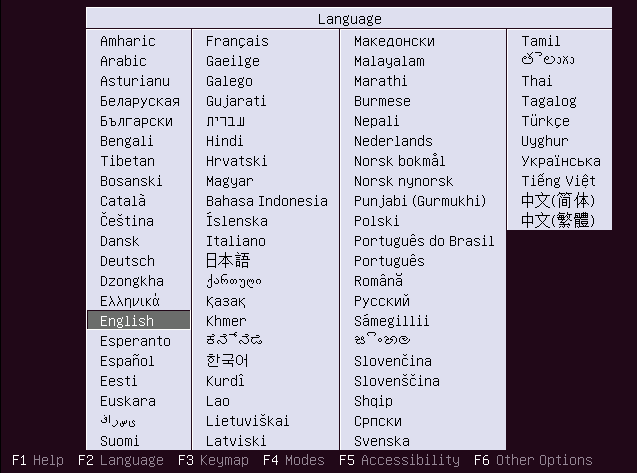

- Chọn **Install Unbuntu Server** để tiến hành cài đặt

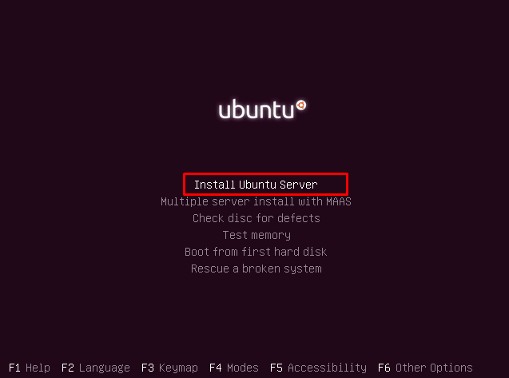

- Lựa chọn ngôn ngữ sử dụng trong hệ điều hành Ubuntu. Chon **English** rồi nhấn **Enter**

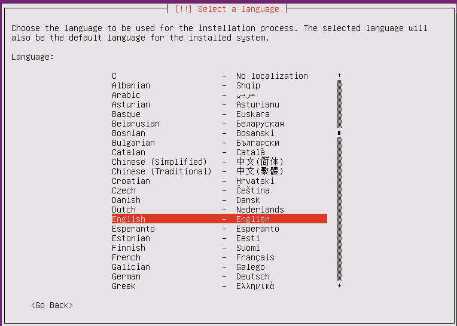

- Lựa chọn khu vực cài đặt 

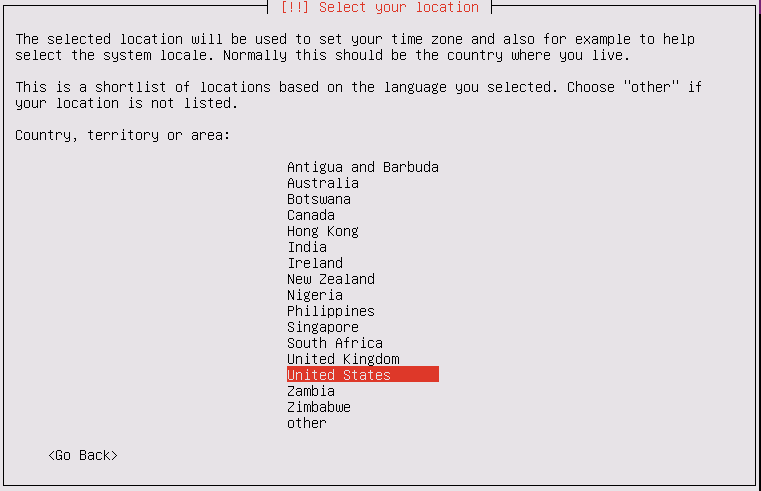

- Cấu hình bàn phím nếu cần. Ở đây mình chọn **No** không cấu hình gì thêm cho bàn phím. 

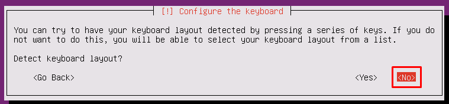

- Cách bố trí bàn phím mỗi quốc gia là khác nhau, một quốc gia có thể có nhiều layout. Chọn Quốc gia xuất xứ cho bàn phím.

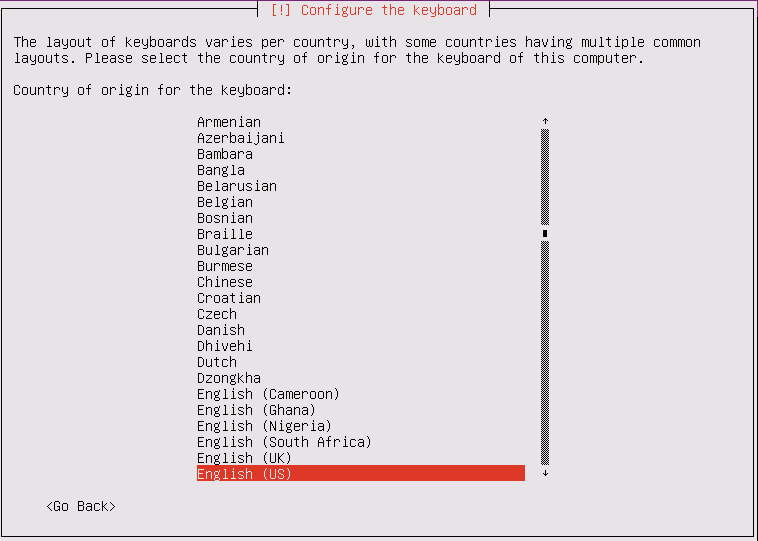

- Chọn chuẩn cú pháp gõ bàn phím cho keyboard. Chọn English(US) 

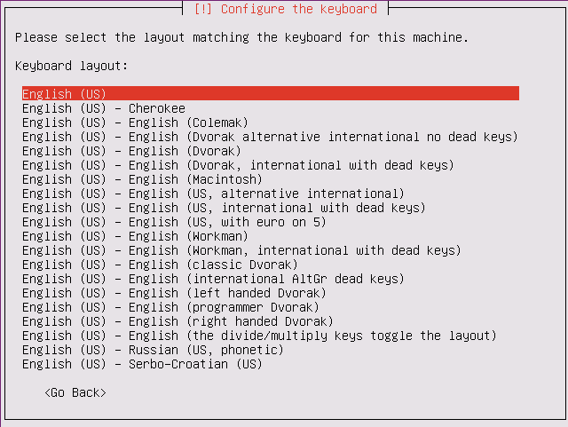

- Cấu hình tên máy 
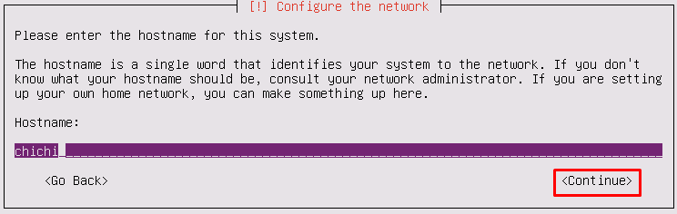

- Khai báo tên thật của người dùng này. Thông tin này sẽ được sử dụng cho các email được gửi bởi người dùng này cũng như bất kỳ chương trình nào hiển thị hoặc sử dụng tên thật của người dùng. 

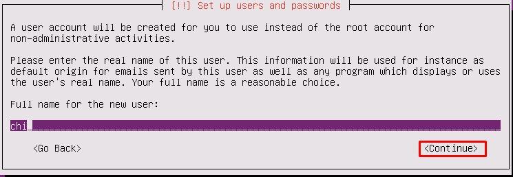

- Khai báo tên tài khoản. Tên phải bắt đầu bằng chữ cái in thường.

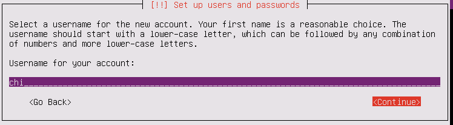

- Thiết lập mật khẩu

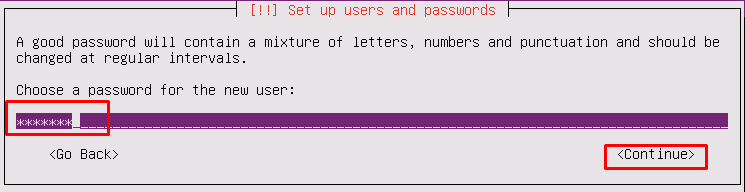

- Nhập lại mật khẩu

- Do mật khẩu mình đặt bao mật chưa cao nên họ hỏi lại có chắc chắn sử dụng pass yếu hay đổi pass mới. Chọn **No** nếu bạn muốn đặt lại mật khẩu. Chọn **Yes** nếu chấp nhận dùng mật khẩu yếu

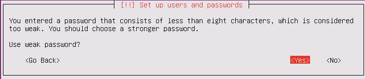

- Bạn có muốn mã hóa thư mục Home để bảo mật hay không. Đây mình chọn **NO**

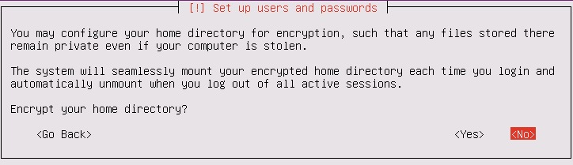

- Time Zone hiện tại của bạn là Asia/phnom_Penh. Nếu chưa chính xác thì bạn lựa chọn lại. Ở đây mình chọn **yes**

- Lựa chọn hình thức cấu hình chia các partition ổ cứng. ( Partition: các phân vùng ổ cứng)

Trình cài đặt sẽ hướng dẫn bạn phân vùng ổ đĩa, hoặc bạn có thể tự phân vùng. Với phân vùng được hướng dẫn thì bạn có thể xem lại và tùy chỉnh kết quả.
Nếu bạn không rành về phần này thì chọn  **Guided-use entire disk**
	- **Guided-use entire disk**: Sử dụng toàn bộ ổ cứng
	- **Guided-use entire disk and set up LVM** Sử dụng toàn bộ ổ cứng và thiết lập LVM
	-**Guided-use entire disk and set up encrypted LVM** Sử dụng toàn bộ ổ cứng và thiết lập mã hóa LVM
	-**Manual**: Tự phân vùng ổ cứng

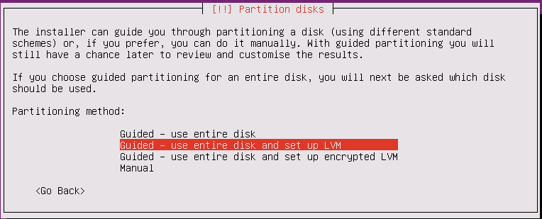

- Lựa chọn ổ cứng cài đặt

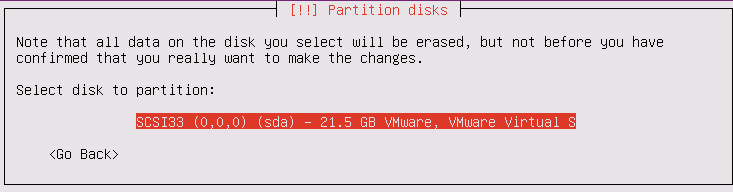

- Ghi nhứng thay đổi vào ổ đĩa và cấu hình LVM

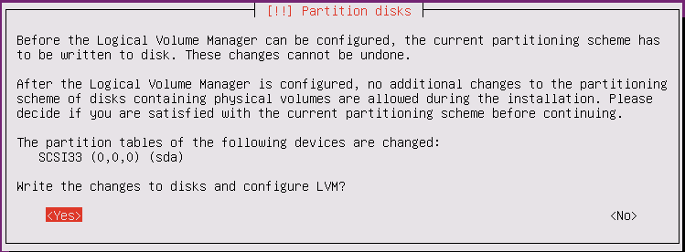

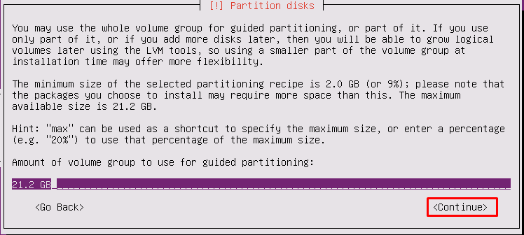

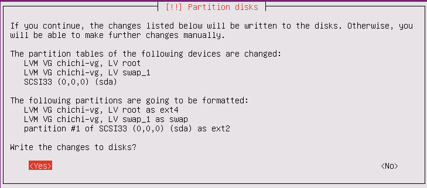

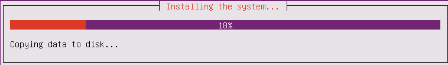

- Cấu hình HTTP nếu thấy cần thiết. Đây mình bỏ trống và chọn **Continue**

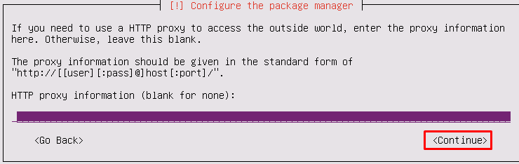

- Quản lý những nâng cấp hệ thống
	
	-**No automatic updates:** Ko tự động cập nhật
	-**Install security updates automatically:** Cài đặt cập nhật bảo mật tự động
	-**Manage system with Landscape:** Quản lý hệ thống với Landscape

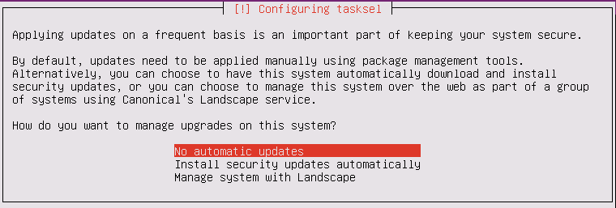
- Lựa chọn một số phần mềm cài đặt cùng

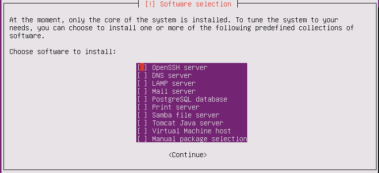

- Cài đặt GRUB boot loader lên ổ cứng để lựa chọn cấu hình ổ cứng. 

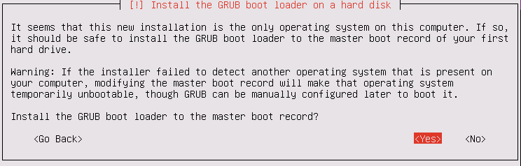

- Sau khi chọn yes  ở trên, quá trình cài đặt OS bắt đầu và kết thúc khi xuất hiện bản thông báo hoàn tất quá trình. Chọn continue và máy sẽ tự restart.

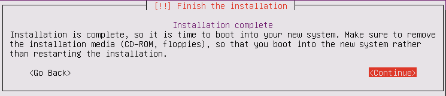
